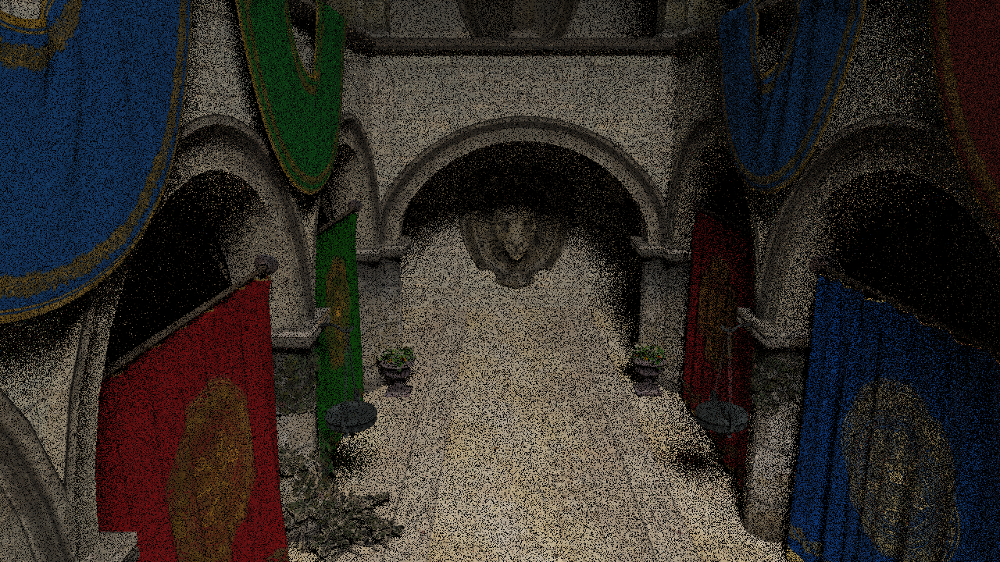
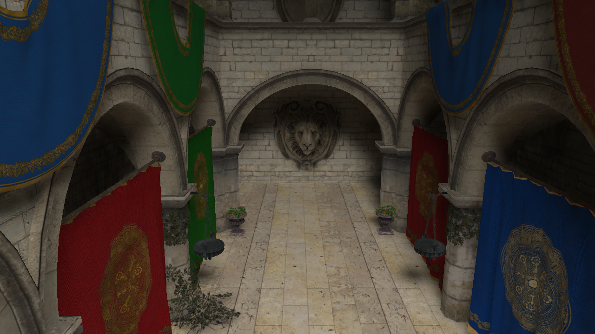

# Spatiotemporal Variance-Guided Filtering implementation in OpenCL

This is an implementation of the  the SVGF algorithm ([Schied et al. 2017][SVGF]) for denoising ray traced images with low sample count.

## Modifications

A few simplifications are made from the original algorithm:

- This implementation does not separate direct and indirect lighting
- It is also only made to tackle static scenes, i.e. there are no motion vectors
- There is also no use of mesh IDs to accumulate samples correctly, which is less of a problem when the scene is assumed static.

## Sample Results

The following shows a ray traced scene with one ray sample per pixel, without denoising



The following shows the same image, after denoising has been applied:



The algorithm uses buffers containing world-positions, surface normals and albedo for each pixel, as well as samples from previous frames to generate the result.

These performance results are obtained on a laptop with GeForce GTX 960M:


```
 Reprojecting samples
 --------------------
   Mean   : 2.022 ms
   Min    : 1.974 ms
   Max    : 2.106 ms
   Total  : 119.273 ms


 Computing variance
 ------------------
   Mean   : 10.180 ms
   Min    : 8.363 ms
   Max    : 21.723 ms
   Total  : 600.639 ms


 Running atrous multiple iterations
 ----------------------------------
   Mean   : 39.488 ms
   Min    : 39.071 ms
   Max    : 40.125 ms
   Total  : 2329.813 ms


 Total
 -----
   Mean   : 51.696 ms
   Min    : 49.515 ms
   Max    : 63.598 ms
   Total  : 3050.049 ms
```

The code is not thoroughly optimized due to time constraints.

When run on desktop hardware, the algorithm is fit for more than 60 frames per second.

## Acknowledgements

Much of the utility code and the structure of the OpenCL code is adapted from [Koskela et al.'s Blockwise Multi-Order Feature Regression implementation][BMFR], although the algorithm itself is completely different.


[SVGF]: https://research.nvidia.com/publication/2017-07_Spatiotemporal-Variance-Guided-Filtering%3A

[BMFR]: https://github.com/maZZZu/bmfr